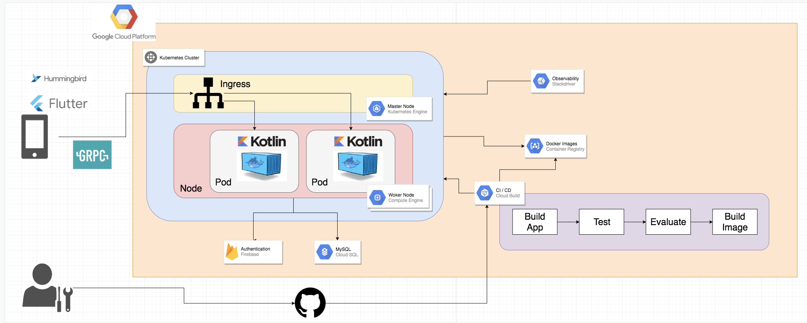

# twitter-mock-kotlin

## Architecture


## The technologies we used.
- gRPC
- Docker
- Kotlin + Spring Boot + JPA
- Firebase Auth / Storage
- GCP (Cloud build, GCR, GKE, Cloud KMS, Cloud SQL, StackDriver)

## Steps to set up.

### To run the application
install docker in your computer and follow the steps below

```
$ cd docker
$ cp .env.example .env
$ docker-compose up -d
$ docker-compose exec migrator /bin/sh
$ mysqldef -uroot -p$MYSQL_ROOT_PASSWORD -hmysql itemae --file=schema.sql
$ exit
$ docker-compose exec server /bin/bash
$ gradle bootRun
```

### about containers
below are the ports to access to each application.

|port|application|
|---|---|
|8888|HTTP server（not used for this project）|
|6565|gRPC server|
|8080|phpMyAdmin|
|13306|MySQL|

### Automatic Restart
Spring will automatically update your changes and restart the application. To use this, you need to run gradle.

Open two terminals.
#### terminal A
```
$ gradle bootRun
```

Edit your code after running gradle. you no longer need to bootRun again. your changes will be automatically updated
#### Terminal B
```
$ gradle classes
```

### Authors
```
Hikaru Suzuki @gammaaex
Tomoka Yokomizo @Tomoka64
Watanabe Noriyuki @noriyu
```
